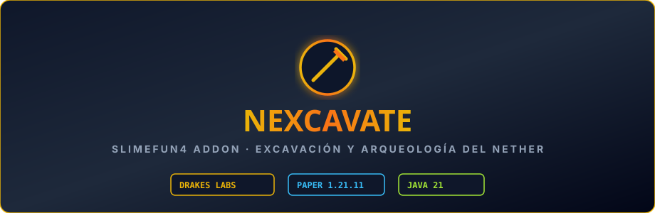

  

# Nexcavate

Addon de **Slimefun 4** enfocado en la reconstrucción y arqueología de una civilización perdida en el Nether. Introduce mesas de investigación, ensamblajes de estructuras multibloque y análisis de vestigios antiguos. Portado, limpiado de traducciones erróneas y optimizado por **DrakesCraft Labs** para Paper/Purpur 1.21.11 en Java 21.

---

## 🎯 Objetivo

Ofrecer una experiencia de progresión profunda y misteriosa mediante arqueología en el Nether, donde los jugadores descubren planos antiguos y construyen maquinaria avanzada a partir de fragmentos fósiles y reliquias.

---

## ⚡ Características Principales

- **Mesa de Investigación y Observación**:
  - Estructura central para descifrar pistas y desbloquear nuevas tecnologías.
- **Estructuras Multibloque y Ensamblajes**:
  - Máquinas que requieren construir estructuras en el mundo con bloques específicos.
- **Comando de Validación**:
  - `/nexcavate validate`: Herramienta de ayuda para jugadores que comprueba si una estructura multibloque está construida u orientada correctamente.
- **Traducción Depurada**:
  - Textos en español corregidos (se eliminaron términos mal traducidos como "Hospedarse" o "asamblea" del port original).

---

## 🛠️ Entorno y Compatibilidad

- **Servidor**: Paper / Purpur 1.21.11
- **Java**: 21
- **Dependencias**:
  - `Slimefun4-Drake`

---

## 📜 Créditos y Origen

- **Autor original**: `qwertyuioplkjhgfd` (Ganador del Slimefun Addon Jam 2022)
- **Adaptación y Mantenimiento 1.21.11**: **DrakesCraft Labs**